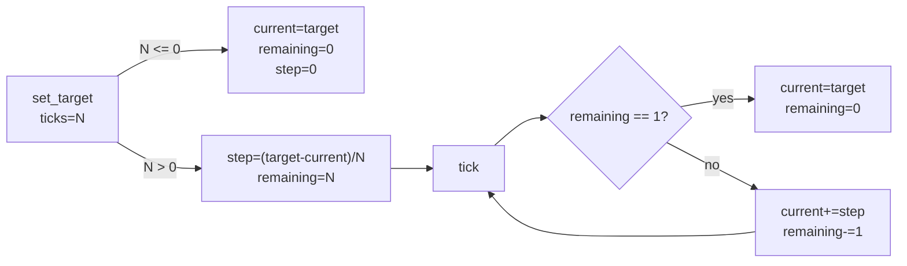
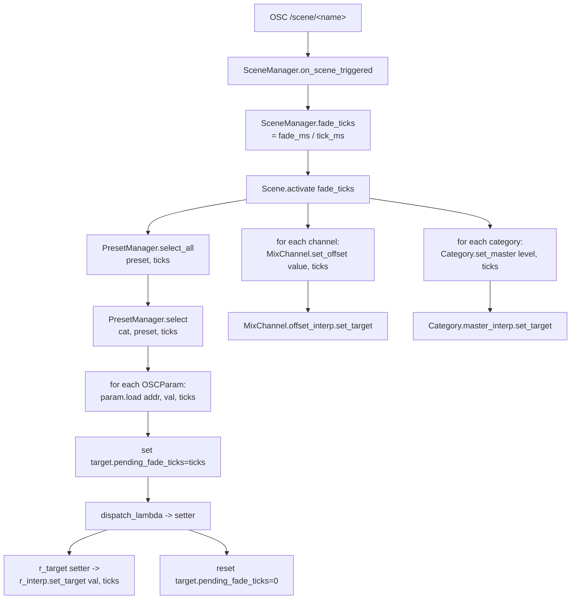
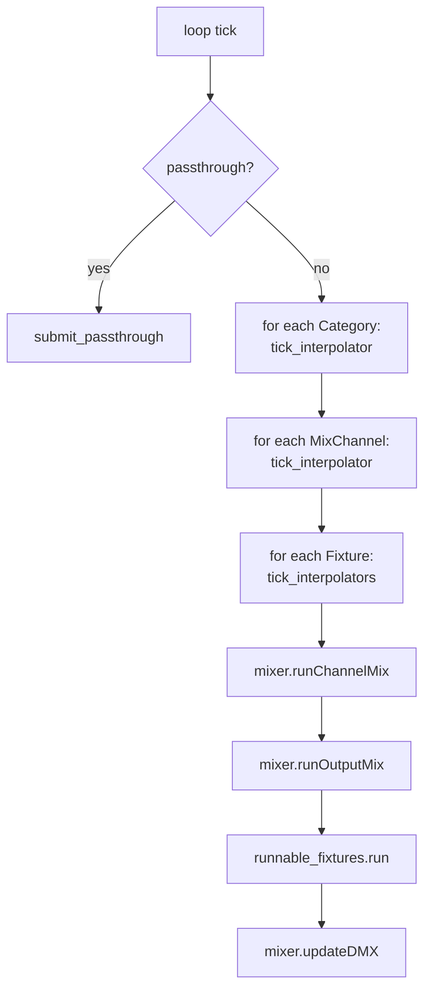

# Change Summary: Scene-Fade Interpolation

**Scope**: Interpolation-related portions of the in-progress (unstaged) changes on `main`. Diffed against `HEAD` per the caller's instruction (repo is currently in a `git bisect` state).

**Branch**: `main` (4 commits ahead of `origin/main`, currently bisecting; diff is unstaged working-tree).

## Table of Contents

- [Files in scope (and out of scope)](#files-in-scope-and-out-of-scope)
- [Glossary](#glossary)
- [Design overview](#design-overview)
  - [The `Interpolator` primitive](#the-interpolator-primitive)
  - [How fade ticks flow from a `Scene.activate` call](#how-fade-ticks-flow-from-a-sceneactivate-call)
  - [Where interpolation is applied (and not applied)](#where-interpolation-is-applied-and-not-applied)
  - [Tick ordering in the main loop](#tick-ordering-in-the-main-loop)
  - [UI mirroring during a fade](#ui-mirroring-during-a-fade)
- [Per-file walkthrough](#per-file-walkthrough)
  - [`util/interpolator.py` (new)](#utilinterpolatorpy-new)
  - [`category.py`](#categorypy)
  - [`fixtures/basics.py`](#fixturesbasicspy)
  - [`fixtures/spotlights.py`](#fixturesspotlightspy)
  - [`generators/chanmap.py`](#generatorschanmappy)
  - [`generators/mixer.py`](#generatorsmixerpy)
  - [`osc.py`](#oscpy)
  - [`preset_manager.py`](#preset_managerpy)
  - [`scene.py`](#scenepy)
  - [`server.py`](#serverpy)
  - [`open-stage-control/layout-config.json`](#open-stage-controllayout-configjson)
- [Excluded files (out-of-scope hunks)](#excluded-files-out-of-scope-hunks)
- [Full diffs](#full-diffs)

## Files in scope (and out of scope)

All interpolation-related, all unstaged:

- `python/parquette-lights/src/parquette/lights/util/interpolator.py` — **new file**, the `Interpolator` primitive.
- `python/parquette-lights/src/parquette/lights/category.py` — adds `master_interp`, `tick_interpolator`, fade arg to `set_master`.
- `python/parquette-lights/src/parquette/lights/fixtures/basics.py` — `RGBLight` / `RGBWLight` r/g/b/w targets become interpolated properties; new `tick_interpolators` hook; `pending_fade_ticks` on `Fixture`.
- `python/parquette-lights/src/parquette/lights/fixtures/spotlights.py` — same treatment for `PinSpot`.
- `python/parquette-lights/src/parquette/lights/generators/chanmap.py` — `MixChannel.offset` becomes interpolated; `tick_interpolator`; `set_offset(value, fade_ticks)`.
- `python/parquette-lights/src/parquette/lights/generators/mixer.py` — `SignalPatchParam.load` grows a `fade_ticks` kwarg (currently unused — just satisfies the new signature).
- `python/parquette-lights/src/parquette/lights/osc.py` — `OSCParam.load` grows `fade_ticks` kwarg that it propagates to `pending_fade_ticks` on `bind_targets`; `bind` stores `bind_targets`.
- `python/parquette-lights/src/parquette/lights/preset_manager.py` — `select` / `select_all` plumb `fade_ticks` through to each `param.load`.
- `python/parquette-lights/src/parquette/lights/scene.py` — `Scene.activate(fade_ticks=0)`; `SceneManager` gains `fade_ms` / `tick_ms` / `fade_ticks()` and an `/scene/fade_ms` OSC handler.
- `python/parquette-lights/src/parquette/lights/server.py` — wires `tick_ms` into `SceneManager`, persists `fade_ms` in the session snapshot, drives `tick_interpolator(s)` on category / mix-channel / fixture before each `runChannelMix`.
- `open-stage-control/layout-config.json` — widens the scenes panel and adds a fade-ms fader + label.

**Not interpolation-related (excluded):**

- `TODOs.md` — strikes two completed bullets ("!Scenes", "!popups…") and adds new ideas. Not in scope.

(No other files have hunks unrelated to interpolation in this diff — every non-TODO change either implements or consumes the interpolation system.)

## Glossary

- **Tick** — one iteration of the main server loop in `server.run`, paced by `--tick-ms` (default 20 ms, i.e. 50 Hz).
- **fade_ms** — user-configurable scene-fade time in milliseconds, exposed via `/scene/fade_ms` and persisted in the session pickle.
- **fade_ticks** — `fade_ms / tick_ms`, computed by `SceneManager.fade_ticks()`. Passed downstream as an `int` count of remaining ticks for an in-flight interpolation.
- **`pending_fade_ticks`** — a transient field set on `Fixture` and `MixChannel` instances by `OSCParam.load` so that subsequent `r_target = ...` / `offset = ...` writes performed inside `dispatch_lambda` know they should interpolate rather than snap.
- **Bind targets** — the list of objects an `OSCParam.bind` writes to (could be one or many); now captured on the param so `load(fade_ticks=N)` can flip `pending_fade_ticks` on each.
- **Interpolator** — the new 4-field linear-tween primitive (`current`, `target`, `remaining_ticks`, `step`).

## Design overview

### The `Interpolator` primitive

A minimal linear-tween class with no easing curves and no time-based scheduling. State is purely in ticks:

| Field             | Purpose                                                                                  |
|-------------------|------------------------------------------------------------------------------------------|
| `current`         | Latest computed value (read out via the getter that replaces `r_target` et al).          |
| `target`          | Final destination.                                                                       |
| `remaining_ticks` | Countdown decremented in `tick()`; when it hits zero, `current` snaps exactly to target. |
| `step`            | Precomputed per-tick delta: `(target - current) / ticks` at `set_target` time.           |



`active` is true while `remaining_ticks > 0`. Note that `set_target(target, 0)` snaps and clears the in-flight tween, but `set_target(target, N)` does **not** require the previous tween to have completed — it recomputes `step` from whatever `current` is right now, so retargeting mid-fade is well-defined.

### How fade ticks flow from a `Scene.activate` call



The trick that ties the OSCParam machinery to the interpolators is **`pending_fade_ticks` as a side-channel**: `OSCParam.load` writes the fade count onto each bind target, calls the existing dispatch (which goes through the property setter), then clears the field. The property setter reads `self.pending_fade_ticks` instead of needing a new signature. This is what lets the preset system fade colors without rewriting every setter / dispatcher signature.

### Where interpolation is applied (and not applied)

| Quantity                                            | Interpolated?            | Driven by                                              |
|-----------------------------------------------------|--------------------------|--------------------------------------------------------|
| `Category.master`                                   | Yes                      | `set_master(value, fade_ticks)` from `Scene.activate`. |
| `MixChannel.offset`                                 | Yes                      | `set_offset(value, fade_ticks)` from `Scene.activate`. |
| `RGBLight.r/g/b_target`                             | Yes                      | Property setter, via `pending_fade_ticks` on fixture.  |
| `RGBWLight.r/g/b/w_target`                          | Yes                      | Same.                                                  |
| `PinSpot.r/g/b/w_target`                            | Yes                      | Same.                                                  |
| Generator `amp`, `period`, `offset`, etc.           | **No** (snap)            | OSCParam.bind ignores `pending_fade_ticks`.            |
| `Spot` color wheel index, pattern, prisim, pan/tilt | **No** (snap)            | Setters do not honor `pending_fade_ticks`.             |
| `SignalPatchParam` (matrix patching)                | **No** (snap)            | `load` accepts `fade_ticks` but ignores it.            |
| Stutter period, BPM mults, etc.                     | **No** (snap)            | Same — fade_ticks is not propagated.                   |
| Dimming (the actual brightness output)              | **No directly** — the generator output is the brightness source, and is unaffected. Master / offset interpolation make brightness fade. | Generator-driven each tick. |

So a "fade" between scenes really means: master faders crossfade, channel offsets crossfade, and the **color targets** that multiply against the generator-driven dimming crossfade. Everything else snaps at tick 0 of the fade.

### Tick ordering in the main loop

The new server loop runs interpolator ticks *before* the existing mix pipeline:



This ordering matters because `MixChannel.tick(ts)` reads `self.offset` (= `_offset_storage`) and multiplies by `self.category.master`. Both must be advanced before `runChannelMix` consumes them, which is what the new code does.

The fixture `tick_interpolators` doesn't feed DMX directly — it just updates `r_interp.current` etc. The next `runOutputMix` → `dimming(val)` → `value_map(val, 0, 255, 0, self.r_target)` then picks up the new `r_target` value (the interpolator's `current`).

### UI mirroring during a fade

Each interpolator owner pushes UI updates differently:

- **`Category.tick_interpolator`** → calls `self.master_param.sync()` each active tick. The UI fader animates.
- **`MixChannel.tick_interpolator`** → calls `self.offset_osc_param.sync()` each active tick. The UI offset fader animates.
- **`RGBLight.tick_interpolators` / `RGBWLight.tick_interpolators` / `PinSpot.tick_interpolators`** → manually `osc.send_osc(self.color_osc_addr, self.color)` (and `w_target_osc_addr` for the W channel). It does **not** route through any `OSCParam` — the addresses are precomputed at construction time (`/fixture/RGBLight/color`, `/fixture/PinSpot/w_target`, etc.). This is because the broadcast addresses are class-level and don't have a single owning `OSCParam`.

## Per-file walkthrough

### `util/interpolator.py` (new)

Single class, ~40 lines, no external deps. Already covered in the design overview. Used at the leaves (`Interpolator` instance per interpolated quantity).

### `category.py`

- New `self.master_interp = Interpolator(1.0)` on construction.
- `set_master` grows a `fade_ticks=0` arg:
  - fade=0 path keeps old behavior (assign `self.master`, sync UI), and also seeds the interpolator's `current/target` so it stays consistent.
  - fade>0 path *only* sets `master_interp.set_target(value, ticks)`. `self.master` and the UI are not touched until subsequent `tick_interpolator()` calls update them.
- New `tick_interpolator()` advances the master interpolator when active, copies into `self.master`, and re-syncs the UI.
- `load_masters` still calls `set_master(value)` with default ticks=0, so session restore is still instantaneous.

### `fixtures/basics.py`

The most substantial change. Three additions:

1. **Base `Fixture`** gains `self.pending_fade_ticks: int = 0` and a no-op `tick_interpolators` virtual hook.
2. **`RGBLight`** — `r_target` / `g_target` / `b_target` are no longer plain attributes; they're now properties backed by `r_interp` / `g_interp` / `b_interp` (init'd at 255.0). The setters call `self.r_interp.set_target(float(value), self.pending_fade_ticks)`. The getter returns the interpolator's `current` (a float). `set_dimming_target` is now keyword-only and gains a `fade_ticks` kwarg. `tick_interpolators` advances all three and broadcasts the new `self.color` to the cached `color_osc_addr` (`/fixture/RGBLight/color`) when any were active.
3. **`RGBWLight`** — same, plus a `w_interp` and a separate `w_target_osc_addr` (`/fixture/RGBWLight/w_target`). The `color_osc_addr` falls back to `/fixture/RGBLight/color` when `use_rgb_color_broadcast` is true (matching the existing class-level color-broadcast convention).

The `dimming(val)` method (which is called every tick by the mixer pipeline to drive the actual DMX channels) reads the same `self.r_target` / etc. getters, so it transparently sees the interpolated values without changes.

### `fixtures/spotlights.py`

Identical pattern to `RGBWLight`, applied to `PinSpot`. `Spot` (the moving head) is **not** touched — its color wheel / pattern / prisim / pan / tilt setters remain instantaneous.

### `generators/chanmap.py`

- `MixChannel.__init__` gets `self.offset_interp = Interpolator(0.0)` and `self.pending_fade_ticks: int = 0`.
- `offset` setter: when `pending_fade_ticks > 0` (set externally by `OSCParam.load`), it routes through the interpolator instead of writing `_offset_storage` directly. Otherwise old behavior.
- `set_offset(value, fade_ticks)` is the explicit fade entry point used by `Scene.activate` for `channel_offsets`.
- `tick_interpolator` writes the interpolated value back into `_offset_storage` (the source of truth for `MixChannel.tick`) and syncs the bound UI param if one was registered.
- `register_offset` now stashes the created `OSCParam` on `self.offset_osc_param` so `tick_interpolator` can find it.

### `generators/mixer.py`

A single, tiny change: `SignalPatchParam.load` adds a `fade_ticks: int = 0` kwarg that it **ignores**. Purely a signature-compatibility patch so that `PresetManager` can call `.load(..., fade_ticks=ticks)` uniformly on every exposed param (since `SignalPatchParam` is a `OSCParam` subclass that overrides `load`).

### `osc.py`

- `OSCParam.__init__` gains `fade_ticks: int = 0` and `bind_targets: Optional[List[Any]] = None`.
- `OSCParam.load` grows `fade_ticks: int = 0`. When non-zero and `bind_targets` is set, it writes `t.pending_fade_ticks = fade_ticks` on each target before dispatching, then clears them after.
- `OSCParam.bind` captures `targets` onto the returned param's `bind_targets` so the above hook has something to iterate.

### `preset_manager.py`

Plumbing-only: `select`, `select_all` accept `fade_ticks=0` and forward it to `param.load(...)`. No behavioral change for the existing fade=0 call sites.

### `scene.py`

- `Scene.activate(fade_ticks=0)` forwards into `MixChannel.set_offset`, `Category.set_master`, and `PresetManager.select_all` / `.select`.
- `SceneManager` adds:
  - `fade_ms: float = 0.0` — user-set scene-fade time.
  - `tick_ms: float = 20.0` — set by `server.run` from the `--tick-ms` flag.
  - `on_fade_change: Optional[Callable]` — fired when `set_fade_ms` is called, so the session pickle gets updated.
  - `/scene/fade_ms` dispatcher that calls `set_fade_ms`.
  - `fade_ticks()` returns `max(1, int(fade_ms / tick_ms))` when both are positive, else 0.
- `SceneManager.sync` now also pushes `/scene/fade_ms` to the UI.
- `on_scene_triggered` passes `self.fade_ticks()` into `scene.activate(...)`.

### `server.py`

- The `sodium_ch` lookup is hoisted above `SceneManager` creation (it was previously defined just below); same value, just reordered so it can be referenced from both `session_snapshot` and `scene_manager`.
- `scene_manager.tick_ms = tick_ms` wires the user's tick rate into the fade conversion.
- `session_snapshot` records `fade_ms` so restarts preserve the chosen fade.
- `scene_manager.on_fade_change = session.save` ties the OSC `/scene/fade_ms` slider to session persistence.
- Restore path reads `fade_ms` back off the session dict.
- The main loop runs `cat.tick_interpolator()`, `ch.tick_interpolator()`, `f.tick_interpolators()` before the existing mix steps (only on the non-passthrough branch).

### `open-stage-control/layout-config.json`

- Scenes panel widens from 600 → 700 px.
- Adds a horizontal fader `scene/fade_ms` at `(top=5, left=510, w=170, h=30)`, range `0..5000`, snap on.
- Adds a `scene_fade_ms_text` textarea showing `Fade @{scene/fade_ms}ms` directly below it.

No sibling widgets in that panel needed repositioning since the additions sit in previously empty space (`left=510..680`) that the widened panel now contains.

## Excluded files (out-of-scope hunks)

- `TODOs.md` — note bullets. Touched in the same working tree but unrelated to interpolation.

There are no mixed-purpose hunks anywhere else in the diff — every other file modification implements or consumes the fade-ticks pipeline.

## Full diffs

<details><summary><strong>util/interpolator.py (new)</strong></summary>

```python
class Interpolator:
    """Linear interpolator for smooth value transitions.

    Wraps a numeric value with a target and step-per-tick. Call tick()
    each frame to advance the current value toward the target. When
    remaining_ticks reaches zero, current snaps exactly to target.
    """

    def __init__(self, value: float = 0.0) -> None:
        self.current = value
        self.target = value
        self.remaining_ticks = 0
        self.step = 0.0

    def set_target(self, target: float, ticks: int = 0) -> None:
        """Begin interpolating toward target over the given number of ticks."""
        self.target = target
        if ticks <= 0:
            self.current = target
            self.remaining_ticks = 0
            self.step = 0.0
        else:
            self.step = (target - self.current) / ticks
            self.remaining_ticks = ticks

    def tick(self) -> float:
        """Advance one tick and return the current value."""
        if self.active:
            self.remaining_ticks -= 1
            if self.remaining_ticks == 0:
                self.current = self.target
            else:
                self.current += self.step
        return self.current

    @property
    def active(self) -> bool:
        """True while an interpolation is in progress."""
        return self.remaining_ticks > 0
```
</details>

### `category.py`

```diff
diff --git a/python/parquette-lights/src/parquette/lights/category.py b/python/parquette-lights/src/parquette/lights/category.py
index ce33085..f401e32 100644
--- a/python/parquette-lights/src/parquette/lights/category.py
+++ b/python/parquette-lights/src/parquette/lights/category.py
@@ -1,6 +1,7 @@
 from typing import Dict, List

 from .osc import OSCManager, OSCParam
+from .util.interpolator import Interpolator
 from .util.session_store import SessionStore


@@ -21,6 +22,7 @@ class Category:
         self.osc = osc
         self.session = session
         self.master: float = 1.0
+        self.master_interp: Interpolator = Interpolator(1.0)

         self.master_param: OSCParam = OSCParam.bind(
             osc,
@@ -30,10 +32,20 @@ class Category:
             on_change=session.save,
         )

-    def set_master(self, value: float) -> None:
-        """Set master value locally and sync to frontend."""
-        self.master = value
-        self.master_param.sync()
+    def set_master(self, value: float, fade_ticks: int = 0) -> None:
+        """Set master value, optionally interpolating over fade_ticks."""
+        if fade_ticks > 0:
+            self.master_interp.set_target(value, fade_ticks)
+        else:
+            self.master = value
+            self.master_interp.set_target(value)
+            self.master_param.sync()
+
+    def tick_interpolator(self) -> None:
+        """Advance the master interpolator and sync if active."""
+        if self.master_interp.active:
+            self.master = self.master_interp.tick()
+            self.master_param.sync()
```

<details><summary><strong>fixtures/basics.py</strong></summary>

```diff
diff --git a/python/parquette-lights/src/parquette/lights/fixtures/basics.py b/python/parquette-lights/src/parquette/lights/fixtures/basics.py
index 6bab389..6140417 100644
--- a/python/parquette-lights/src/parquette/lights/fixtures/basics.py
+++ b/python/parquette-lights/src/parquette/lights/fixtures/basics.py
@@ -4,6 +4,7 @@ from typing import Callable, ClassVar, List, Optional
 from ..category import Category
 from ..dmx import DMXManager, DMXListOrValue, DMXValue
 from ..osc import OSCManager, OSCParam
+from ..util.interpolator import Interpolator
 from ..util.math import constrain, value_map


@@ -67,10 +68,14 @@ class Fixture(object):
         self.osc = osc
         self.runnable: bool = False
         self.wrapped_targets: List[MixTarget] = []
+        self.pending_fade_ticks: int = 0

     def run(self) -> None:
         pass

+    def tick_interpolators(self) -> None:
+        """Advance any active interpolators. Override in subclasses."""
+
     def post_map_output(self) -> None:
         """Called once per mixer tick after every channel has finished
         contributing to this fixture's MixTargets. Default: no-op.
@@ -187,9 +192,34 @@ class RGBLight(LightFixture):
         super().__init__(
             name=name, category=category, dmx=dmx, addr=addr, num_chans=3, osc=osc
         )
-        self.r_target: DMXValue = 255
-        self.g_target: DMXValue = 255
-        self.b_target: DMXValue = 255
+        self.r_interp: Interpolator = Interpolator(255.0)
+        self.g_interp: Interpolator = Interpolator(255.0)
+        self.b_interp: Interpolator = Interpolator(255.0)
+        self.color_osc_addr: str = "/fixture/{}/color".format(type(self).__name__)
+
+    @property
+    def r_target(self) -> DMXValue:
+        return self.r_interp.current
+
+    @r_target.setter
+    def r_target(self, value: DMXValue) -> None:
+        self.r_interp.set_target(float(value), self.pending_fade_ticks)
+
+    @property
+    def g_target(self) -> DMXValue:
+        return self.g_interp.current
+
+    @g_target.setter
+    def g_target(self, value: DMXValue) -> None:
+        self.g_interp.set_target(float(value), self.pending_fade_ticks)
+
+    @property
+    def b_target(self) -> DMXValue:
+        return self.b_interp.current
+
+    @b_target.setter
+    def b_target(self, value: DMXValue) -> None:
+        self.b_interp.set_target(float(value), self.pending_fade_ticks)

     @property
     def color(self) -> List:
@@ -198,7 +228,12 @@ class RGBLight(LightFixture):
     @color.setter
     def color(self, value: List) -> None:
         if len(value) >= 3:
-            self.set_dimming_target(r=value[0], g=value[1], b=value[2])
+            self.set_dimming_target(
+                r=value[0],
+                g=value[1],
+                b=value[2],
+                fade_ticks=self.pending_fade_ticks,
+            )

     def color_param(self, osc: OSCManager) -> OSCParam:
         """Preset-saved class-level color bind at /fixture/{ClassName}/color.
@@ -212,16 +247,26 @@ class RGBLight(LightFixture):

     def set_dimming_target(
         self,
+        *,
         r: Optional[DMXValue] = None,
         g: Optional[DMXValue] = None,
         b: Optional[DMXValue] = None,
+        fade_ticks: int = 0,
     ) -> None:
-        if not r is None:
-            self.r_target = r
-        if not g is None:
-            self.g_target = g
-        if not b is None:
-            self.b_target = b
+        if r is not None:
+            self.r_interp.set_target(float(r), fade_ticks)
+        if g is not None:
+            self.g_interp.set_target(float(g), fade_ticks)
+        if b is not None:
+            self.b_interp.set_target(float(b), fade_ticks)
+
+    def tick_interpolators(self) -> None:
+        active = self.r_interp.active or self.g_interp.active or self.b_interp.active
+        self.r_interp.tick()
+        self.g_interp.tick()
+        self.b_interp.tick()
+        if active and self.osc is not None:
+            self.osc.send_osc(self.color_osc_addr, self.color)

     def dimming(self, val: DMXValue) -> None:
         self._dimming = val
@@ -250,11 +295,46 @@ class RGBWLight(LightFixture):
         super().__init__(
             name=name, category=category, dmx=dmx, addr=addr, num_chans=4, osc=osc
         )
-        self.r_target: DMXValue = 255
-        self.g_target: DMXValue = 255
-        self.b_target: DMXValue = 255
-        self.w_target: DMXValue = 255
+        self.r_interp: Interpolator = Interpolator(255.0)
+        self.g_interp: Interpolator = Interpolator(255.0)
+        self.b_interp: Interpolator = Interpolator(255.0)
+        self.w_interp: Interpolator = Interpolator(255.0)
         self.use_rgb_color_broadcast = use_rgb_color_broadcast
+        color_class = "RGBLight" if use_rgb_color_broadcast else type(self).__name__
+        self.color_osc_addr: str = "/fixture/{}/color".format(color_class)
+        self.w_target_osc_addr: str = "/fixture/{}/w_target".format(type(self).__name__)
+
+    @property
+    def r_target(self) -> DMXValue:
+        return self.r_interp.current
+
+    @r_target.setter
+    def r_target(self, value: DMXValue) -> None:
+        self.r_interp.set_target(float(value), self.pending_fade_ticks)
+
+    @property
+    def g_target(self) -> DMXValue:
+        return self.g_interp.current
+
+    @g_target.setter
+    def g_target(self, value: DMXValue) -> None:
+        self.g_interp.set_target(float(value), self.pending_fade_ticks)
+
+    @property
+    def b_target(self) -> DMXValue:
+        return self.b_interp.current
+
+    @b_target.setter
+    def b_target(self, value: DMXValue) -> None:
+        self.b_interp.set_target(float(value), self.pending_fade_ticks)
+
+    @property
+    def w_target(self) -> DMXValue:
+        return self.w_interp.current
+
+    @w_target.setter
+    def w_target(self, value: DMXValue) -> None:
+        self.w_interp.set_target(float(value), self.pending_fade_ticks)

     @property
     def color(self) -> List:
@@ -263,7 +343,12 @@ class RGBWLight(LightFixture):
     @color.setter
     def color(self, value: List) -> None:
         if len(value) >= 3:
-            self.set_dimming_target(r=value[0], g=value[1], b=value[2])
+            self.set_dimming_target(
+                r=value[0],
+                g=value[1],
+                b=value[2],
+                fade_ticks=self.pending_fade_ticks,
+            )

     def color_param(self, osc: OSCManager) -> OSCParam:
         """Preset-saved class-level color bind.
@@ -285,19 +370,36 @@ class RGBWLight(LightFixture):

     def set_dimming_target(
         self,
+        *,
         r: Optional[DMXValue] = None,
         g: Optional[DMXValue] = None,
         b: Optional[DMXValue] = None,
         w: Optional[DMXValue] = None,
+        fade_ticks: int = 0,
     ) -> None:
-        if not r is None:
-            self.r_target = r
-        if not g is None:
-            self.g_target = g
-        if not b is None:
-            self.b_target = b
-        if not w is None:
-            self.w_target = w
+        if r is not None:
+            self.r_interp.set_target(float(r), fade_ticks)
+        if g is not None:
+            self.g_interp.set_target(float(g), fade_ticks)
+        if b is not None:
+            self.b_interp.set_target(float(b), fade_ticks)
+        if w is not None:
+            self.w_interp.set_target(float(w), fade_ticks)
+
+    def tick_interpolators(self) -> None:
+        rgb_active = (
+            self.r_interp.active or self.g_interp.active or self.b_interp.active
+        )
+        w_active = self.w_interp.active
+        self.r_interp.tick()
+        self.g_interp.tick()
+        self.b_interp.tick()
+        self.w_interp.tick()
+        if self.osc is not None:
+            if rgb_active:
+                self.osc.send_osc(self.color_osc_addr, self.color)
+            if w_active:
+                self.osc.send_osc(self.w_target_osc_addr, self.w_target)
```

</details>

<details><summary><strong>fixtures/spotlights.py</strong></summary>

```diff
diff --git a/python/parquette-lights/src/parquette/lights/fixtures/spotlights.py b/python/parquette-lights/src/parquette/lights/fixtures/spotlights.py
index 96cf3fd..ad49b9f 100644
--- a/python/parquette-lights/src/parquette/lights/fixtures/spotlights.py
+++ b/python/parquette-lights/src/parquette/lights/fixtures/spotlights.py
@@ -13,6 +13,7 @@ from ..coord_system_state import CoordSystemState
 from ..osc import OSCManager, OSCParam
 from ..util.coord_system import CoordSystem
 from ..util.coordinates import SpotCoordFrame
+from ..util.interpolator import Interpolator
 from ..util.math import constrain, value_map
 from .basics import LightFixture, MixTarget
 from ..dmx import DMXManager, DMXValue, DMXControlChannel, DMXControlRange
@@ -1012,10 +1013,44 @@ class PinSpot(LightFixture):
         super().__init__(
             name=name, category=category, dmx=dmx, addr=addr, num_chans=6, osc=osc
         )
-        self.r_target: DMXValue = 255
-        self.g_target: DMXValue = 255
-        self.b_target: DMXValue = 255
-        self.w_target: DMXValue = 255
+        self.r_interp: Interpolator = Interpolator(255.0)
+        self.g_interp: Interpolator = Interpolator(255.0)
+        self.b_interp: Interpolator = Interpolator(255.0)
+        self.w_interp: Interpolator = Interpolator(255.0)
+        self.color_osc_addr: str = "/fixture/{}/color".format(type(self).__name__)
+        self.w_target_osc_addr: str = "/fixture/{}/w_target".format(type(self).__name__)
+
+    @property
+    def r_target(self) -> DMXValue:
+        return self.r_interp.current
+
+    @r_target.setter
+    def r_target(self, value: DMXValue) -> None:
+        self.r_interp.set_target(float(value), self.pending_fade_ticks)
+
+    @property
+    def g_target(self) -> DMXValue:
+        return self.g_interp.current
+
+    @g_target.setter
+    def g_target(self, value: DMXValue) -> None:
+        self.g_interp.set_target(float(value), self.pending_fade_ticks)
+
+    @property
+    def b_target(self) -> DMXValue:
+        return self.b_interp.current
+
+    @b_target.setter
+    def b_target(self, value: DMXValue) -> None:
+        self.b_interp.set_target(float(value), self.pending_fade_ticks)
+
+    @property
+    def w_target(self) -> DMXValue:
+        return self.w_interp.current
+
+    @w_target.setter
+    def w_target(self, value: DMXValue) -> None:
+        self.w_interp.set_target(float(value), self.pending_fade_ticks)

     @property
     def color(self) -> List:
@@ -1024,7 +1059,12 @@ class PinSpot(LightFixture):
     @color.setter
     def color(self, value: List) -> None:
         if len(value) >= 3:
-            self.set_dimming_target(r=value[0], g=value[1], b=value[2])
+            self.set_dimming_target(
+                r=value[0],
+                g=value[1],
+                b=value[2],
+                fade_ticks=self.pending_fade_ticks,
+            )

     def color_param(self, osc: OSCManager) -> OSCParam:
         """Preset-saved class-level color bind at /fixture/PinSpot/color."""
@@ -1038,19 +1078,36 @@ class PinSpot(LightFixture):

     def set_dimming_target(
         self,
+        *,
         r: Optional[DMXValue] = None,
         g: Optional[DMXValue] = None,
         b: Optional[DMXValue] = None,
         w: Optional[DMXValue] = None,
+        fade_ticks: int = 0,
     ) -> None:
-        if not r is None:
-            self.r_target = r
-        if not g is None:
-            self.g_target = g
-        if not b is None:
-            self.b_target = b
-        if not w is None:
-            self.w_target = w
+        if r is not None:
+            self.r_interp.set_target(float(r), fade_ticks)
+        if g is not None:
+            self.g_interp.set_target(float(g), fade_ticks)
+        if b is not None:
+            self.b_interp.set_target(float(b), fade_ticks)
+        if w is not None:
+            self.w_interp.set_target(float(w), fade_ticks)
+
+    def tick_interpolators(self) -> None:
+        rgb_active = (
+            self.r_interp.active or self.g_interp.active or self.b_interp.active
+        )
+        w_active = self.w_interp.active
+        self.r_interp.tick()
+        self.g_interp.tick()
+        self.b_interp.tick()
+        self.w_interp.tick()
+        if self.osc is not None:
+            if rgb_active:
+                self.osc.send_osc(self.color_osc_addr, self.color)
+            if w_active:
+                self.osc.send_osc(self.w_target_osc_addr, self.w_target)
```

</details>

### `generators/chanmap.py`

```diff
diff --git a/python/parquette-lights/src/parquette/lights/generators/chanmap.py b/python/parquette-lights/src/parquette/lights/generators/chanmap.py
index 7f5095c..eb41eca 100644
--- a/python/parquette-lights/src/parquette/lights/generators/chanmap.py
+++ b/python/parquette-lights/src/parquette/lights/generators/chanmap.py
@@ -5,6 +5,7 @@ from . import Generator
 from ..fixtures.basics import MixTarget
 from ..category import Category
 from ..osc import OSCManager, OSCParam
+from ..util.interpolator import Interpolator
 from ..util.math import constrain

 TICK_MS: int = 20
@@ -96,6 +97,8 @@ class MixChannel:
         history_size = self.mapper.required_history_ticks()
         self.history: deque = deque([0.0] * history_size, maxlen=history_size)
         self._offset_storage: float = 0.0
+        self.offset_interp: Interpolator = Interpolator(0.0)
+        self.pending_fade_ticks: int = 0
         self.impulse_generator = impulse_generator
         self.impulse_connected = impulse_generator is not None
         self.connected_generators: List[Generator] = []
@@ -106,7 +109,26 @@ class MixChannel:

     @offset.setter
     def offset(self, value: Any) -> None:
-        self._offset_storage = float(value)
+        fade = getattr(self, "pending_fade_ticks", 0)
+        if fade > 0:
+            self.offset_interp.set_target(float(value), fade)
+        else:
+            self._offset_storage = float(value)
+            self.offset_interp.set_target(float(value))
+
+    def set_offset(self, value: float, fade_ticks: int = 0) -> None:
+        """Set offset, optionally interpolating over fade_ticks."""
+        if fade_ticks > 0:
+            self.offset_interp.set_target(value, fade_ticks)
+        else:
+            self.offset = value
+
+    def tick_interpolator(self) -> None:
+        """Advance the offset interpolator and sync UI if active."""
+        if self.offset_interp.active:
+            self._offset_storage = self.offset_interp.tick()
+            if hasattr(self, "offset_osc_param") and self.offset_osc_param is not None:
+                self.offset_osc_param.sync()

     def tick(self, ts: float) -> None:
         """Compute current value and push into history (O(1) via deque)."""
@@ -145,13 +167,16 @@ class MixChannel:
         self, osc: OSCManager, on_change: Optional[Callable[[], None]] = None
     ) -> OSCParam:
         """Bind /chan/{name}/offset to this channel's offset attribute."""
-        return OSCParam.bind(
+        self.offset_osc_param: Optional[OSCParam] = None
+        param = OSCParam.bind(
             osc,
             "/chan/{}/offset".format(self.name),
             self,
             "offset",
             on_change=on_change,
         )
+        self.offset_osc_param = param
+        return param

     @property
     def stutter_period(self) -> int:
```

### `generators/mixer.py`

```diff
diff --git a/python/parquette-lights/src/parquette/lights/generators/mixer.py b/python/parquette-lights/src/parquette/lights/generators/mixer.py
index ab91928..ed25e52 100644
--- a/python/parquette-lights/src/parquette/lights/generators/mixer.py
+++ b/python/parquette-lights/src/parquette/lights/generators/mixer.py
@@ -491,7 +491,9 @@ class SignalPatchParam(OSCParam):
             mappings.append(gen_mapping)
         return mappings

-    def load(self, addr: str, *args: Any, sync: bool = True) -> None:
+    def load(
+        self, addr: str, *args: Any, sync: bool = True, fade_ticks: int = 0
+    ) -> None:
         for chan_name in self.chan_names:
             self.mixer.clearSignalMatrix(chan_name)
```

### `osc.py`

```diff
diff --git a/python/parquette-lights/src/parquette/lights/osc.py b/python/parquette-lights/src/parquette/lights/osc.py
index dbe27c7..98f7656 100644
--- a/python/parquette-lights/src/parquette/lights/osc.py
+++ b/python/parquette-lights/src/parquette/lights/osc.py
@@ -103,6 +103,8 @@ class OSCParam(object):
         self.on_change = on_change
         self.has_default = default_value is not _MISSING
         self.default_value = default_value if self.has_default else None
+        self.fade_ticks: int = 0
+        self.bind_targets: Optional[List[Any]] = None

         def handler(a: str, *osc_args: Any) -> None:
             dispatch_lambda(a, *osc_args)
@@ -112,8 +114,20 @@ class OSCParam(object):
         self.dispatch_lambda = handler
         osc.dispatcher.map(addr, handler)

-    def load(self, addr: str, *osc_args: Any, sync: bool = True) -> None:
+    def load(
+        self, addr: str, *osc_args: Any, sync: bool = True, fade_ticks: int = 0
+    ) -> None:
+        self.fade_ticks = fade_ticks
+        if fade_ticks > 0 and self.bind_targets is not None:
+            for t in self.bind_targets:
+                if hasattr(t, "pending_fade_ticks"):
+                    t.pending_fade_ticks = fade_ticks
         self.dispatch_lambda(addr, *osc_args)
+        if fade_ticks > 0 and self.bind_targets is not None:
+            for t in self.bind_targets:
+                if hasattr(t, "pending_fade_ticks"):
+                    t.pending_fade_ticks = 0
+        self.fade_ticks = 0
         if sync:
             self.sync()

@@ -155,7 +169,7 @@ class OSCParam(object):
                 value = list(args)
             cls.obj_param_setter(value, field, targets)

-        return cls(
+        param = cls(
             osc,
             addr,
             lambda: getattr(primary, field),
@@ -163,6 +177,8 @@ class OSCParam(object):
             on_change=on_change,
             default_value=getattr(primary, field),
         )
+        param.bind_targets = targets
+        return param

     @classmethod
     def obj_param_setter(cls, value: Any, field: str, objs: List[Any]) -> None:
```

### `preset_manager.py`

```diff
diff --git a/python/parquette-lights/src/parquette/lights/preset_manager.py b/python/parquette-lights/src/parquette/lights/preset_manager.py
index ba4d453..40c6a56 100644
--- a/python/parquette-lights/src/parquette/lights/preset_manager.py
+++ b/python/parquette-lights/src/parquette/lights/preset_manager.py
@@ -64,7 +64,7 @@ class PresetManager(object):
             all_categories.add(key)
         return all_categories

-    def select_all(self, category_preset: str) -> None:
+    def select_all(self, category_preset: str, fade_ticks: int = 0) -> None:
         # Early-out only if we already have a known selection for every
         # category and they all match the target. With empty current_presets
         # (fresh launch, nothing selected yet) `all(...)` over an empty
@@ -86,9 +86,9 @@ class PresetManager(object):
                 cat in self.stored_presets
                 and category_preset in self.stored_presets[cat]
             ):
-                self.select(cat, category_preset, sync=False)
+                self.select(cat, category_preset, sync=False, fade_ticks=fade_ticks)
             else:
-                self.select(cat, "Off", sync=False)
+                self.select(cat, "Off", sync=False, fade_ticks=fade_ticks)

         self.sync()

@@ -236,7 +236,13 @@ class PresetManager(object):

         self.osc.send_osc("/enable_save", int(self.enable_save_clear))

-    def select(self, category: str, category_preset: str, sync: bool = True) -> None:
+    def select(
+        self,
+        category: str,
+        category_preset: str,
+        sync: bool = True,
+        fade_ticks: int = 0,
+    ) -> None:
         cat = self.categories.by_name(category)
         if cat not in self.exposed_params:
             # there are no valid exposed params in this category to control
@@ -264,7 +270,9 @@ class PresetManager(object):
         # no OSC sync per-param — we issue one final sync at the end.
         for param in self.exposed_params[cat]:
             if param.has_default:
-                param.load(param.addr, param.default_value, sync=False)
+                param.load(
+                    param.addr, param.default_value, sync=False, fade_ticks=fade_ticks
+                )

         # Apply the saved overrides on top of the defaults.
         for param_preset in self.stored_presets[category][category_preset]:
@@ -272,9 +280,9 @@ class PresetManager(object):
             for param in self.exposed_params[cat]:
                 if param.addr == addr:
                     if isinstance(value, (list, tuple)):
-                        param.load(addr, *value, sync=False)
+                        param.load(addr, *value, sync=False, fade_ticks=fade_ticks)
                     else:
-                        param.load(addr, value, sync=False)
+                        param.load(addr, value, sync=False, fade_ticks=fade_ticks)

         if sync:
             self.sync()
```

### `scene.py`

```diff
diff --git a/python/parquette-lights/src/parquette/lights/scene.py b/python/parquette-lights/src/parquette/lights/scene.py
index 525f70f..78873a3 100644
--- a/python/parquette-lights/src/parquette/lights/scene.py
+++ b/python/parquette-lights/src/parquette/lights/scene.py
@@ -1,4 +1,4 @@
-from typing import Any, Dict, Optional
+from typing import Any, Callable, Dict, Optional

 import os
 import pickle
@@ -48,22 +48,24 @@ class Scene:
         self.disable_passthrough = disable_passthrough
         self.protect_save_clear = protect_save_clear

-    def activate(self) -> None:
+    def activate(self, fade_ticks: int = 0) -> None:
         if self.disable_passthrough and self.dmx.passthrough:
             self.dmx.passthrough = False

         for channel, offset in self.channel_offsets.items():
-            channel.offset = offset
+            channel.set_offset(offset, fade_ticks)

         for category, level in self.masters.items():
-            category.set_master(level)
+            category.set_master(level, fade_ticks)

         if self.preset_all is not None:
-            self.presets.select_all(self.preset_all)
+            self.presets.select_all(self.preset_all, fade_ticks=fade_ticks)

         if self.presets_by_category:
             for category, preset_name in self.presets_by_category.items():
-                self.presets.select(category.name, preset_name, sync=False)
+                self.presets.select(
+                    category.name, preset_name, sync=False, fade_ticks=fade_ticks
+                )
             self.presets.sync()

     def to_dict(self) -> Dict[str, Any]:
@@ -136,6 +138,9 @@ class SceneManager:

         self.scenes: Dict[str, Scene] = {}
         self.selected_scene: Optional[Scene] = None
+        self.fade_ms: float = 0.0
+        self.tick_ms: float = 20.0
+        self.on_fade_change: Optional[Callable] = None

         osc.dispatcher.map(
             "/scene/create", lambda addr, *args: self.create_scene(str(args[0]))
@@ -144,6 +149,10 @@ class SceneManager:
         osc.dispatcher.map(
             "/scene/clear_current", lambda addr, *args: self.clear_scene()
         )
+        osc.dispatcher.map(
+            "/scene/fade_ms",
+            lambda addr, *args: self.set_fade_ms(float(args[0])),
+        )
         osc.dispatcher.map(
             "/scene/*", lambda addr, *args: self.on_scene_triggered(addr)
         )
@@ -155,13 +164,25 @@ class SceneManager:
         """Register a scene so it appears in the dropdown."""
         self.scenes[scene.name] = scene

+    def set_fade_ms(self, value: float) -> None:
+        """Set fade time and notify session to save."""
+        self.fade_ms = value
+        if self.on_fade_change is not None:
+            self.on_fade_change()
+
+    def fade_ticks(self) -> int:
+        """Convert current fade_ms to tick count."""
+        if self.fade_ms <= 0 or self.tick_ms <= 0:
+            return 0
+        return max(1, int(self.fade_ms / self.tick_ms))
+
     def on_scene_triggered(self, addr: str) -> None:
         """Handle all /scene/* messages: activate and track the scene."""
         name = addr.split("/scene/", 1)[1]
         scene = self.scenes.get(name)
         if scene is not None:
             self.selected_scene = scene
-            scene.activate()
+            scene.activate(fade_ticks=self.fade_ticks())

     def capture_current_state(self) -> Scene:
         """Build a Scene from the current lighting state."""
@@ -279,8 +300,9 @@ class SceneManager:
         os.replace(tmp, self.filename)

     def sync(self) -> None:
-        """Push scene list to the UI dropdown."""
+        """Push scene list and fade time to the UI."""
         values: Dict[str, str] = {name: name for name in self.scenes}
         self.osc.send_osc("/scene_selector/values", [str(values)])
         if self.selected_scene:
             self.osc.send_osc("/scene_selector", self.selected_scene.name)
+        self.osc.send_osc("/scene/fade_ms", self.fade_ms)
```

### `server.py`

```diff
diff --git a/python/parquette-lights/src/parquette/lights/server.py b/python/parquette-lights/src/parquette/lights/server.py
index 7049876..bc8e355 100644
--- a/python/parquette-lights/src/parquette/lights/server.py
+++ b/python/parquette-lights/src/parquette/lights/server.py
@@ -335,22 +335,25 @@ def run(
         defaults_file=defaults_file,
     )

+    sodium_ch = mixer.channel_lookup["sodium/dimming"]
+
+    scene_manager = SceneManager(  # noqa: F841  pylint: disable=unused-variable
+        osc, dmx, presets, categories, filename=scenes_file, debug=debug
+    )
+    scene_manager.tick_ms = tick_ms
+
     def session_snapshot():
         masters = categories.save_masters()
-        masters["sodium"] = mixer.channel_lookup["sodium/dimming"].offset
+        masters["sodium"] = sodium_ch.offset
         return {
             "current_presets": presets.save_current_selection(),
             "masters": masters,
             "coord_system": coord_state.active_name,
+            "fade_ms": scene_manager.fade_ms,
         }

     session.bind(session_snapshot)
-
-    sodium_ch = mixer.channel_lookup["sodium/dimming"]
-
-    scene_manager = SceneManager(  # noqa: F841  pylint: disable=unused-variable
-        osc, dmx, presets, categories, filename=scenes_file, debug=debug
-    )
+    scene_manager.on_fade_change = session.save

     scene_manager.register_scene(
         Scene(
@@ -428,7 +431,9 @@ def run(
         masters = restored.get("masters") or {}
         categories.load_masters(masters)
         if "sodium" in masters:
-            mixer.channel_lookup["sodium/dimming"].offset = masters["sodium"]
+            sodium_ch.offset = masters["sodium"]
+        if "fade_ms" in restored:
+            scene_manager.fade_ms = float(restored["fade_ms"])

     if debug:
         print("DEBUG channel generator connections after restore:", flush=True)
@@ -468,6 +473,12 @@ def run(
             if dmx.passthrough:
                 dmx.submit_passthrough()
             else:
+                for cat in categories.all:
+                    cat.tick_interpolator()
+                for ch in mixer.mix_channels:
+                    ch.tick_interpolator()
+                for f in all_fixtures:
+                    f.tick_interpolators()
                 mixer.runChannelMix()
                 mixer.runOutputMix()
                 for f in runnable_fixtures:
```

### `open-stage-control/layout-config.json`

```diff
diff --git a/open-stage-control/layout-config.json b/open-stage-control/layout-config.json
index 329509d..ed8769a 100644
--- a/open-stage-control/layout-config.json
+++ b/open-stage-control/layout-config.json
@@ -88,7 +88,7 @@
             "left": 0,
             "id": "scenes_panel",
             "interaction": true,
-            "width": 600,
+            "width": 700,
             "height": 150,
             "value": "",
             "default": "",
@@ -252,6 +252,41 @@
                 "bypass": true,
                 "click": false,
                 "onValue": "if (value) send('/scene/clear_current', 1)"
+              },
+              {
+                "type": "fader",
+                "id": "scene/fade_ms",
+                "top": 5,
+                "left": 510,
+                "width": 170,
+                "height": 30,
+                "interaction": true,
+                "horizontal": true,
+                "design": "default",
+                "snap": true,
+                "range": { "min": 0, "max": 5000 },
+                "value": 0,
+                "address": "auto",
+                "pips": false, "dashed": false, "gradient": [],
+                "touchZone": "all", "spring": false, "doubleTap": false,
+                "logScale": false, "sensitivity": 1, "steps": "",
+                "default": "", "decimals": 0, "bypass": false
+              },
+              {
+                "type": "textarea",
+                "id": "scene_fade_ms_text",
+                "top": 42,
+                "left": 510,
+                "width": 170,
+                "height": 25,
+                "interaction": false,
+                "value": "Fade @{scene/fade_ms}ms",
+                "alphaStroke": 0,
+                "alphaFillOn": 0,
+                "bypass": true,
+                "default": "",
+                "address": "auto",
+                "decimals": 0
+              }
             ],
             "tabs": []
```

---

You may want to add `.code-reviews/` to `.gitignore` so these review docs don't get accidentally committed.
